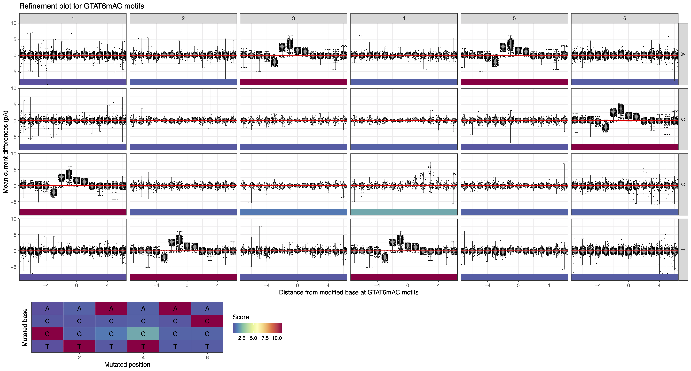

.. sectnum::
  :suffix: .

.. _detailed-tutorial-content:

We recommend users to first consult the :ref:`Tool showcase <tool-showcase-page>` before this detailed tutorial. To demonstrate the toolbox applications and facilitate an understanding of the methods, we build-in example datasets for SMRT and ONT analyses in `MeMoRe app <https://fanglab-tools.shinyapps.io/MeMoRe/>`_.

.. _Principle:

Principle
=========

In prokaryote and archaea, DNA modification are motif-driven, meaning that nearly all occurrences of the same sequence motif(s) will be modified. This property can be used to refine the motifs discovered from `SMRT Portal/Link Base Modification Analysis <https://www.pacb.com/support/software-downloads/>`_ or `nanodisco <https://github.com/fanglab/nanodisco>`_ pipelines.

For each methylation motif *de novo* discovered, we identify all occurrences in the provided reference genome, and we aggregate the methylation signal to provide a simple visual representation for motif sequence validation. The same procedure is repeated for all related motifs with one substitution to confirmed that the methylation is unique to the motif of interest. For example, considering GATC *de novo* discovered, we also extract the methylation signal for AATC, CATC, TATC, GCTC, GGTC, GTTC, GAAC, GACC, GAGC, GATA, GATG, GATT.

* `Analysis of SMRT results`_

Analysis of SMRT results
------------------------

In SMRT sequencing, DNA methylation affect the kinetics of the polymerases used for the sythesis of the SMRTBell templates. The changes of polymerase's kinetics are observed through the Inter-Pulse Duration (IPD) metric which are compared to prediction from an *in silico* model at each genomic position. The resulting metric is called the IPD ratio (IPD native/IPD *in silico*). For 6mA and 4mC DNA modification, the IPD ratio increase on top of the methylated positions while an IPD ratio of 1 means no kinetic change. However, 5mC do not typically produce detectable signal and cannot be reliably found from SMRT data.

The following figures showcase typical situations that can be resolved with `MeMoRe` analysis: *de novo* discovered motif is incomplete, *de novo* discovered motif is too general, and partially overlapping *de novo* discovered motifs.

..
  TTT6mACNNNNNGTG TTTACNNNNNGTG 4 6mA 99.00
..
  TTT6mAYNNNNNGTG TTTAYNNNNNGTG 4 6mA 99.00
..
  GAC6mAT GACAT 4 6mA 99.00
..
  NNGAC6mATNN NNGACATNN 6 6mA 99.00
..
  VGAC6mAT  VGACAT  5 6mA 99.00
..
  GAT5mC  GATC  4 5mC 99.00
..
  GTAT6mAC  GTATAC  5 6mA 99.00

* `Analysis of ONT results`_

Analysis of ONT results
-----------------------

In ONT sequencing, DNA methylation affect the electric current measured while the DNA molecules transfers through the nanopores. Using `nanodisco <https://github.com/fanglab/nanodisco>`_, current differences between the native and the Whole Genome Amplified samples are computed at each genomic position and this metric represent the methylation signal for ONT dataset. The further from 0 the current difference are, the more likely the genomic is modified. Contrary to SMRT sequencing, the signal is broadly distributed and not restricted to the modified base, meaning that signal for multiple genomic positions needs to be monitored.

The following figures showcase typical situations that can be resolved with `MeMoRe` analysis: *de novo* discovered motif is incomplete, *de novo* discovered motif is too general, and partially overlapping *de novo* discovered motifs.

Incomplete motif
^^^^^^^^^^^^^^^^

It shows disturbed current differences only from the motif of interest (i.e. GTATAC), while the related motifs (with one substitution) have current difference at background levels (distribution centered around zero).

..
  GGT5mCC GGTCC 4 5mC 99.00
..
  GGW5mCC GGWCC 4 5mC 99.00

Motif too general
^^^^^^^^^^^^^^^^^

..
  GAC6mAT GACAT 4 6mA 99.00
..
  NNGAC6mATNN NNGACATNN 6 6mA 99.00
..
  VGAC6mAT  VGACAT  5 6mA 99.00

Overlapping motifs
^^^^^^^^^^^^^^^^^^

..
  GAT5mC  GATC  4 5mC 99.00
..
  GTAT6mAC  GTATAC  5 6mA 99.00

   **Figure 2**: MeMoRe results for ONT dataset of C. perfringens's GTAT6mAC methylation motif. Two metrics are visualized: 1. Current differences distribution, 2. Methylation motif score
