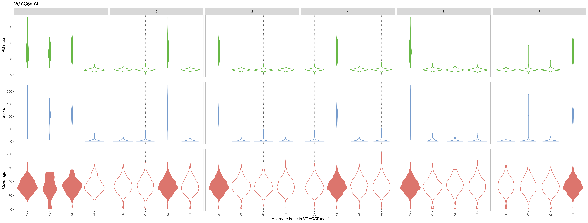

.. sectnum::
  :suffix: .

.. _detailed-tutorial-content:

We recommend users to first consult the :ref:`Tool showcase <tool-showcase-page>` before this detailed tutorial. To demonstrate the toolbox applications and facilitate an understanding of the methods, we build-in example datasets for SMRT and ONT analyses in `MeMoRe app <https://fanglab-tools.shinyapps.io/MeMoRe/>`_.

* `Analysis of SMRT results`_
* `Analysis of ONT results`_

.. _Principle:

Analytical principle
====================

In prokaryote and archaea, DNA modification are motif-driven, meaning that nearly all occurrences of the same sequence motif(s) will be modified. This property can be used to refine the motifs discovered from `SMRT Portal/Link Base Modification Analysis <https://www.pacb.com/support/software-downloads/>`_ or `nanodisco <https://github.com/fanglab/nanodisco>`_ pipelines.

For each methylation motif *de novo* discovered, we identify all occurrences in the provided reference genome, and we aggregate the methylation signal to provide a simple visual representation for motif sequence validation. The same procedure is repeated for all related motifs with one substitution to confirmed that the methylation is unique to the motif of interest. For example, considering GATC *de novo* discovered, we also extract the methylation signal for AATC, CATC, TATC, GCTC, GGTC, GTTC, GAAC, GACC, GAGC, GATA, GATG, GATT.

.. _SMRT_analysis:

Analysis of SMRT results
========================

In SMRT sequencing, DNA methylation affect the kinetics of the polymerases used for the sythesis of the SMRTBell templates. The changes of polymerase's kinetics are observed through the Inter-Pulse Duration (IPD) metric which are compared to prediction from an *in silico* model at each genomic position. The resulting metric is called the IPD ratio (IPD native/IPD *in silico*). For 6mA and 4mC DNA modification, the IPD ratio increase on top of the methylated positions while an IPD ratio of 1 means no kinetic change. However, 5mC do not typically produce detectable signal and cannot be reliably found from SMRT data.

The following figures showcase typical situations that can be resolved with `MeMoRe` analysis: *de novo* discovered motif is incomplete, and *de novo* discovered motif is too general. They were generated from an hypothetical *de novo* methylation motif analysis resulting in the following set of motifs:

* TTT6mACNNNNNGTG (has error)
* GAC6mAT (has error)
* GTAT6mAC
* C6mACNNNNNRTAAA
* WGG4mCCW
* GGW5mCC (not detectable with SMRT data)
* GAT5mC (not detectable with SMRT data)
* 5mCCGG (not detectable with SMRT data)

Motif is too general
--------------------

In this example, the putative motif reported by the analytical pipeline is GAC6mAT. We run MeMoRe on the dataset, and the visualization only shows **partial** high IPD ratio for GAC6mAT (i.e. dense IPD ratio distribution at background level, around one), while the other related motifs (with one substitution) have IPD ratio at background levels (see Figure 1). This indicate that the putative motif is too general and that the actual methylation motif must be more precise.

.. figure:: figures/GACAT_4_combined.png
   :width: 800
   :align: center
   :alt: C. perfringens's GAC6mAT methylation motif results

   **Figure 1**: MeMoRe results for SMRT dataset of C. perfringens's GAC6mAT methylation motif.

To refine the motif of interest, we can use the "Motif summary" panel to extend the motif evaluation space by adding "NN" as prefix and suffix so that many more motif compositions are considered (e.g. **A**\ GACAT, **T**\ NGACAT, GACATN\ **C**, etc.). The resulting analysis is displayed in Figure 2 below.

   **Figure 2**: MeMoRe results for SMRT dataset of C. perfringens's NNGAC6mATNN methylation motif.

This indicate that the actual methylation motif is VGAC6mAT (V = A , C, or G). The resulting motif can be added to the "Motif summary" panel and the associated plot can be generated (see Figure 3 below).

   **Figure 3**: MeMoRe results for SMRT dataset of C. perfringens's VGAC6mAT methylation motif.

Motif is incomplete
-------------------

In this example, the putative motif reported by the analytical pipeline is TTT6mACNNNNNGTG. We run MeMoRe on the dataset, and the visualization shows high IPD ratio for TTTACNNNNNGTG, and TTTATNNNNNGTG, while the other related motifs (with one substitution) have IPD ratio at background levels (see Figure 4). This indicate that the putative motif is incomplete and that the actual methylation motif is TTT6mAYNNNNNGTG (Y = C or T).

.. figure:: figures/TTTACNNNNNGTG_combined.png
   :width: 800
   :align: center
   :alt: C. perfringens's TTT6mACNNNNNGTG methylation motif results

   **Figure 4**: MeMoRe results for SMRT dataset of C. perfringens's TTT6mACNNNNNGTG methylation motif.

We can use the "Motif summary" panel to add the complete motif and generate the associated plot (see Figure 5 below).

.. figure:: figures/TTTAYNNNNNGTG_combined.png
   :width: 800
   :align: center
   :alt: C. perfringens's TTT6mAYNNNNNGTG methylation motif results

   **Figure 5**: MeMoRe results for SMRT dataset of C. perfringens's TTT6mAYNNNNNGTG methylation motif.

Analysis of ONT results
=======================

In ONT sequencing, DNA methylation affect the electric current measured while the DNA molecules transfers through the nanopores. Using `nanodisco <https://github.com/fanglab/nanodisco>`_, current differences between the native and the Whole Genome Amplified samples are computed at each genomic position and this metric represent the methylation signal for ONT dataset. The further from 0 the current difference are, the more likely the genomic is modified. Contrary to SMRT sequencing, the signal is broadly distributed and not restricted to the modified base, meaning that signal for multiple genomic positions needs to be monitored.

The following figures showcase typical situations that can be resolved with `MeMoRe` analysis: *de novo* discovered motif is too general, *de novo* discovered motif is incomplete, and partially overlapping *de novo* discovered motifs. They were generated from an hypothetical *de novo* methylation motif analysis resulting in the following set of motifs:

* GAC6mAT (has error)
* GGT5mCC (has error)
* GAT5mC
* 5mCCGG
* GTAT6mAC
* TTT6mAYNNNNNGTG
* C6mACNNNNNRTAAA
* WGG4mCCW

Motif is too general
--------------------

In this example, the putative motif reported by the analytical pipeline is GAC6mAT. We run MeMoRe on the dataset, and the visualization only shows **partial** current differences disturbence for GAC6mAT (i.e. dense current difference distribution at background level, around zero), while the other related motifs (with one substitution) have current difference at background levels (see Figure 6). This indicate that the putative motif is too general and that the actual methylation motif must be more precise.

   **Figure 6**: MeMoRe results for ONT dataset of C. perfringens's GAC6mAT methylation motif.

To refine the motif of interest, we can use the "Motif summary" panel to extend the motif evaluation space by adding "NN" as prefix and suffix so that many more motif compositions are considered (e.g. **A**\ GACAT, **T**\ NGACAT, GACATN\ **C**, etc.). The resulting analysis is displayed in Figure 7 below.

   **Figure 7**: MeMoRe results for ONT dataset of C. perfringens's NNGAC6mATNN methylation motif.

This indicate that the actual methylation motif is VGAC6mAT (V = A , C, or G). The resulting motif can be added to the "Motif summary" panel and the associated plot can be generated (see Figure 8 below). The figure also shows weak signal for VGACCT which is explained by partial overlap with GGWCC (i.e. GGACCt, see `Overlapping motifs`_).

.. figure:: figures/VGACAT_5_ont.png
   :width: 800
   :align: center
   :alt: C. perfringens's VGAC6mAT methylation motif results

   **Figure 8**: MeMoRe results for ONT dataset of C. perfringens's VGAC6mAT methylation motif.

Motif is incomplete
-------------------

In this example, the putative motif reported by the analytical pipeline is GGT5mCC. We run MeMoRe on the dataset, and the visualization shows disturbed current differences for GGTCC, GGACC, and GATCC, while the other related motifs (with one substitution) have current difference at background levels (see Figure 9). GATCC is fully overlapping with GATC and therefore is not new (see `Overlapping motifs`_). This indicate that the putative motif is incomplete and that the actual methylation motif is GGW5mCC (W = A or T).

   **Figure 9**: MeMoRe results for ONT dataset of C. perfringens's GGT5mCC methylation motif.

We can use the "Motif summary" panel to add the complete motif and generate the associated plot (see Figure 10 below). We also observed two addionnals related motifs with signal as GGWCC overlap with other motifs (i.e. GGWTC and GGWCA which respectively correspond to GATC and GACAT, see `Overlapping motifs`_).

   **Figure 10**: MeMoRe results for ONT dataset of C. perfringens's GGW5mCC methylation motif.

.. _ONT overlap:

Overlapping motifs
------------------

In this example, the motif reported by the analytical pipeline is GAT5mC. We run MeMoRe on the dataset, and the visualization shows disturbed current differences for GATC but also GGTC and GACC, while the other related motifs (with one substitution) have current difference at background levels (see Figure 11). GGTC and GACC are partially overlapping with GGWCC and therefore are not new. This indicate that all the additional methylation signal can be explained by GGW5mCC, therefore GATC and GGWCC explains all the signal visualized.

   **Figure 11**: MeMoRe results for ONT dataset of C. perfringens's GAT5mC methylation motif. Two metrics are visualized: 1. Current differences distribution, 2. Methylation motif score

This can be visualy confirmed by generating the refine plot for HGATCD (H = A, C, or T; D = A, G, or T) which explicitly exclude overlaps with GGW5mCC.

   **Figure 12**: MeMoRe results for ONT dataset of C. perfringens's HGAT5mCD methylation motif. Two metrics are visualized: 1. Current differences distribution, 2. Methylation motif score
